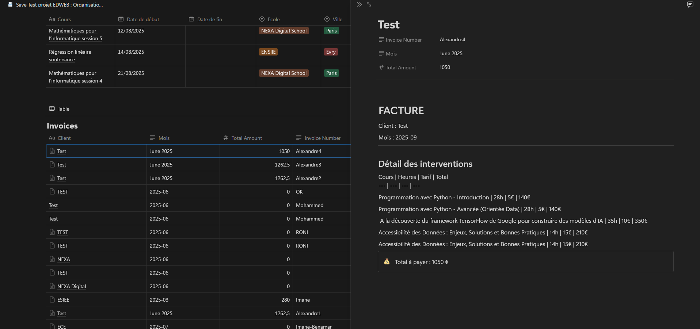

# Rapport d'exercice

## Travaux réalisés

- Création d'un script Python pour récupération des données de l'API
- Création d'un script Python pour l'analyse des données avec les dataframes
- Création d'un jupyter notebook pour la visualisation des données
- Création d'une fonction pour la création d'une facture
- Création d'une fonction pour marquer les interventions comme facturées

## Problèmes rencontrés
- Problème : lors que l'analyse de la structure des données renvoyées par l'API
- Solution : utilisation d'outil de beautification de json
- Problème : lors de la création de la facture avec les données récupérées, car toutes les interventions n'avaient pas de date de fin
- Solution : aucune touvée à ce jour
- Problème : de navigation dans les objets de la réponse de l'API
- Solution : pas de solution à par de pas utiliser l'API

## Conclusion et améliorations
- Amélioration de la fonction de création de facture pour gérer les interventions sans date de fin
- Amélioration de la visualisation des données pour une meilleure compréhension
- Amélioration de la documentation du code pour faciliter la compréhension et la maintenance
- Amélioration de la gestion des erreurs lors de la récupération des données de l'API

